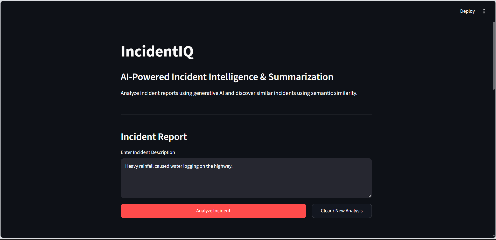
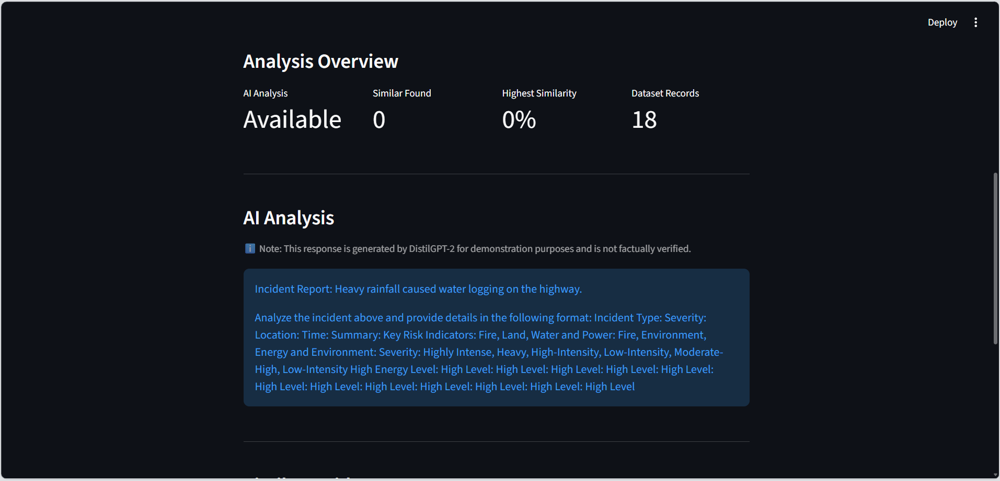
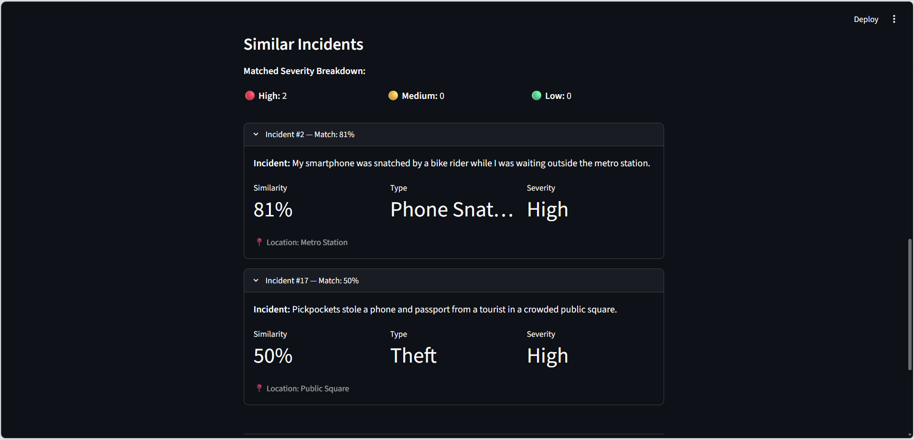

# 🚨 IncidentIQ - AI-Powered Incident Intelligence

<p align="center">
  
  
  
  
</p>

<p align="center">
  <b>AI-powered incident analysis and semantic similarity search using LLMs and text embeddings.</b>
</p>

---

## 📌 Overview

**IncidentIQ** is a beginner-friendly Generative AI application that analyzes incident descriptions and identifies semantically similar incidents from a historical dataset.

The application combines two AI approaches:

- **DistilGPT-2** for AI-generated incident analysis
- **all-MiniLM-L6-v2** for text embeddings and semantic similarity

The application is built with **Python and Streamlit** and uses a local JSON dataset containing fictional incident records.

---

## ✨ Features

- 🤖 AI-powered incident analysis
- 📝 Prompt-based text generation
- 🔎 Semantic similarity search
- 🧠 Text embeddings using Sentence Transformers
- 📊 Cosine similarity-based matching
- 📋 Top 3 similar incident results
- 📍 Incident type, severity, and location
- 📈 Simple analysis overview dashboard
- 🔄 Clear and start a new analysis
- ⚠️ Basic error handling
- 📚 Educational explanations inside the application

---

## 🔄 How It Works

```text
                    User
                      │
                      ▼
             Incident Description
                      │
             ┌────────┴────────┐
             │                 │
             ▼                 ▼
        DistilGPT-2       all-MiniLM-L6-v2
             │                 │
             ▼                 ▼
       AI Analysis         Embedding
                               │
                               ▼
                      Cosine Similarity
                               │
                               ▼
                        incidents.json
                               │
                               ▼
                  Top Similar Incidents
````

### AI Analysis

The incident description is sent to **DistilGPT-2** using a structured prompt to generate an AI-based analysis.

### Similarity Search

The same incident is converted into a numerical vector using **all-MiniLM-L6-v2**.

The vector is compared with stored incident vectors using **cosine similarity**.

The application then displays the most similar incidents.

---

## 🛠️ Tech Stack

| Technology                       | Purpose             |
| -------------------------------- | ------------------- |
| 🐍 **Python**                    | Application logic   |
| 🎈 **Streamlit**                 | Web interface       |
| 🤗 **Hugging Face Transformers** | LLM integration     |
| 🧠 **DistilGPT-2**               | Text generation     |
| 🔤 **Sentence Transformers**     | Text embeddings     |
| 🔎 **all-MiniLM-L6-v2**          | Semantic embeddings |
| 📐 **scikit-learn**              | Cosine similarity   |
| 🔥 **PyTorch**                   | Model execution     |
| 📄 **JSON**                      | Incident dataset    |

---

## 📂 Project Structure

```text
IncidentIQ/
│
├── app.py
├── llm.py
├── incidents.json
├── requirements.txt
├── README.md
├── .gitignore
│
└── screenshots/
    ├── incidentiq-main-interface.png
    ├── incidentiq-ai-analysis.png.png
    └── incidentiq-similar-incidents.png.png
```

### File Responsibilities

**`app.py`**

Main Streamlit application containing the UI, dataset handling, embeddings, similarity search, and dashboard.

**`llm.py`**

Handles the DistilGPT-2 text-generation pipeline and incident analysis prompt.

**`incidents.json`**

Contains 18 fictional incident records used for semantic similarity search.

**`requirements.txt`**

Contains the Python dependencies required to run the project.

---

## 🧠 AI Components

### 1. DistilGPT-2

DistilGPT-2 is used for generating AI-based incident analysis from the user's input.

The model receives a structured prompt and generates text based on the incident description.

> Note: DistilGPT-2 is a small text-generation model and may sometimes produce repetitive or incomplete responses.

### 2. all-MiniLM-L6-v2

The Sentence Transformer model converts incident descriptions into numerical embeddings.

These embeddings allow the application to compare the semantic meaning of different incident descriptions.

### 3. Cosine Similarity

Cosine similarity measures how similar two vectors are.

In IncidentIQ, it is used to compare the user's incident embedding with the embeddings of incidents stored in `incidents.json`.

---

## 📊 Dataset

IncidentIQ uses a small local JSON dataset containing **18 fictional incident records**.

Each record contains:

```text
id
incident
type
severity
location
```

Example:

```json
{
  "id": 4,
  "incident": "An unknown individual followed someone near a railway station after dark.",
  "type": "Stalking",
  "severity": "High",
  "location": "Railway Station"
}
```

### Important

`incidents.json` is **not used to train or fine-tune DistilGPT-2**.

It is only used as a searchable dataset during application runtime.

---

## 🖥️ Screenshots

### Main Interface



### AI Analysis



### Similar Incident Detection



---

## 🚀 Getting Started

### Prerequisites

Make sure you have:

* Python 3.9+
* pip
* Git

### 1. Clone the repository

```bash
git clone https://github.com/Jeswin-Madona/IncidentIQ.git
```

```bash
cd IncidentIQ
```

### 2. Create a virtual environment

#### Windows

```powershell
python -m venv venv
```

Activate it:

```powershell
venv\Scripts\activate
```

#### macOS / Linux

```bash
python3 -m venv venv
```

```bash
source venv/bin/activate
```

### 3. Install dependencies

```bash
pip install -r requirements.txt
```

### 4. Run the application

```bash
streamlit run app.py
```

The application will normally be available at:

```text
http://localhost:8501
```

---

## 💡 Example Input

```text
Yesterday at around 8 PM, I was walking near the railway station
when a man started following me. I entered a nearby shop and
waited until he left.
```

The application processes this incident through two paths:

```text
Incident
   │
   ├──► DistilGPT-2
   │       └──► AI Analysis
   │
   └──► Sentence Transformer
           └──► Embedding
                   └──► Cosine Similarity
                           └──► Similar Incidents
```

---

## ⚠️ Limitations

* DistilGPT-2 is a relatively small text-generation model.
* Generated responses may occasionally be repetitive or incomplete.
* AI-generated analysis is not factual verification.
* Similarity scores represent semantic similarity, not proof that two incidents are actually connected.
* The project uses a small fictional dataset.
* The application is intended for educational purposes and is **not designed for real-world emergency decision-making**.

---

## 🔮 Future Improvements

Possible improvements include:

* Use a stronger instruction-tuned LLM
* Expand the incident dataset
* Store incidents in PostgreSQL
* Use a vector database for larger datasets
* Implement Retrieval-Augmented Generation (RAG)
* Add authentication and role-based access
* Add human verification workflows
* Deploy the application to the cloud

---

## 📚 Learning Outcomes

Through this project, I practiced:

* Generative AI fundamentals
* Large Language Models
* Prompt engineering
* Hugging Face Transformers
* Text embeddings
* Semantic similarity
* Cosine similarity
* Streamlit application development
* Integrating multiple AI components into one application

---

## 🎓 Workshop Project

**IncidentIQ** was developed as part of a **5-Day Generative AI Workshop**.

### Development Progress

```text
Day 1 → LLM & text generation
Day 2 → Prompt-based incident analysis
Day 3 → Streamlit web interface
Day 4 → Embeddings & semantic similarity
Day 5 → Dashboard, error handling & documentation
```

---

## 👨‍💻 Author

**Jeswin Madona M**

Computer Science Engineering Student

* GitHub: [@Jeswin-Madona](https://github.com/Jeswin-Madona)
* LinkedIn: [Jeswin Madona](https://www.linkedin.com/in/jeswinmadona/)

---

<p align="center">
  Built with Python, Generative AI, and curiosity 🚀
</p>

